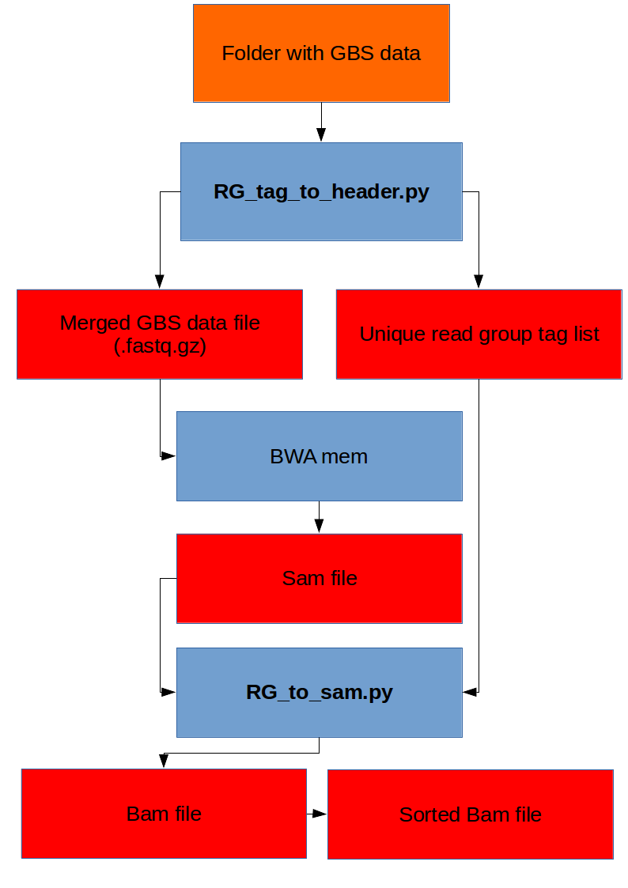

========
Pipeline
========

Introduction
------------
This pipeline will identify minimal SNP markers for the identification of the cultivar variatie.

.. _mylabel:

   This is the caption of the figure (a simple paragraph).

Configuration
-------------
.. highlight:: yaml
.. code-block:: yaml

  # Configuration in YAML
   reference_genome:
     /nfs/BigData01/Big_Data/Genomes/Lolium_perenne/clean_genome_lolium.fna.gz
   output_dir:
     /nfs/BigData01/Big_Data/Lolium/results/grassen_pipeline_2/
   basename:
     grassen_name # how your data is called, plz do not use a extension here.
   merge_files:
     input_dir:   /nfs/BigData01/Big_Data/Lolium/raw_sequences/
   pair_file:
     grassen_pairs.txt
   variant_caller:
     samtools
   #  freebayes
   method:
     frequency
   #  snps
   vcf_filter:
     -q: 20
     -d: 30
     -s: 30
     -r: 0.8
   configure_snp_set:
     genetic_distance: 5
   flanking_sequences:
     length: 100
